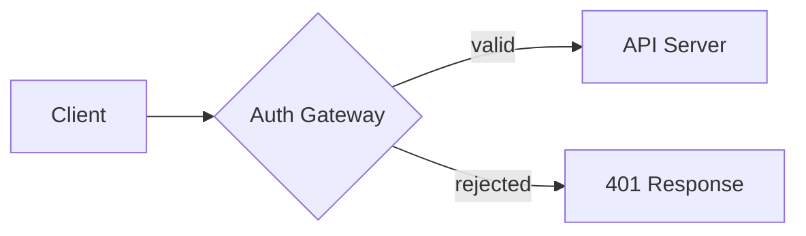

# forgr

> Convert Markdown into polished PDFs. One command, zero config.

<div align="center">


</div>

## Features

- **Five presets** — `terminal`, `minimal`, `technical`, `academic`, `newsletter`, each a standalone CSS theme built from the ground up.
- **Diagrams** — native [Mermaid](https://mermaid.js.org) rendering (flowchart, sequence, state, class) with per-preset color theming.
- **Images** — local images are inlined automatically as base64 data URIs, so they resolve without a base URL.
- **Table of contents** — generated automatically for longer documents (>= 8000 words or 3+ pages).
- **No install friction** — Chromium downloads on your first run, not during `npm install`.

---

## Install

```bash
npm install -g forgr
```

Chromium (~195MB) is not downloaded during install — it downloads automatically on your first `forgr` run into `~/.forgr/browsers`. Subsequent runs skip this step.

---

## Quick start

```bash
# Output goes to the same directory as the input file
forgr report.md

# Custom output path
forgr report.md --output /path/to/output.pdf

# Choose a preset
forgr report.md --preset academic
```

## Presets

Pick a design with `--preset <name>`. Each preset is a standalone CSS theme built from the ground up, so the five are visually distinct rather than reskins of one template.

| Preset | Identity | Best for |
|---|---|---|
| `terminal` | All-mono headings, graphite/cold-teal palette, dark terminal-pane code blocks, `01 02 03` section counters | Infra reports, status dashboards, incident reviews |
| `minimal` | System sans, single gray, hairline rules, no accent | Clean, neutral documents |
| `technical` | Fully monospace, amber accent, full-grid tables, tinted code panels, `[NN]` bracket section markers | Runbooks, config specs, ops notes |
| `academic` | Book serif throughout, pine-green accent, arabic section numbers in the margin against a hairline vertical rule | Papers, theses, scholarly write-ups |
| `newsletter` | Warm off-white paper, serif headings, sans-serif body, terra-cotta coral accent, generous measure | Product changelogs, editorial round-ups, org announcements |

```bash
forgr document.md --preset technical
```

---

## Diagrams & images

Mermaid code blocks render to SVG inside the PDF. The diagram palette follows the active preset's accent color.

````bash
forgr document.md

# document.md

````

Local images referenced with a relative path are embedded as base64, so the PDF is self-contained:

```markdown

```

Remote URLs (`http://`, `https://`) and existing `data:` URIs pass through unchanged.

---

## Table of contents

A table of contents is added automatically when a document is long enough — 8000 or more words, or 3 or more pages. Control it explicitly with `--toc` / `--no-toc`:

```bash
forgr long-report.md --toc
forgr short-note.md --no-toc
```

---

## CLI reference

| Flag | Description |
|---|---|
| `--output <path>` | Write the PDF to a specific path instead of next to the input file. |
| `--preset <name>` | Apply a preset: `terminal` (default), `minimal`, `technical`, `academic`, `newsletter`. |
| `--toc` / `--no-toc` | Force the table of contents on or off. Without either, it is decided automatically. |
| `uninstall` | Remove the Chromium cache (~195MB) without removing the tool. |

### Interactive preset picker

`forgr-tui` launches a terminal UI that lists every preset (built-in plus any you
define in `~/.config/forgr/presets/*.json`) and renders the PDF with the one you
pick. User presets are shown for discovery; rendering custom presets lands with
config support in a later milestone.

```bash
forgr-tui report.md
forgr-tui report.md -o out.pdf --no-toc
```

---

## Uninstall

Free up the Chromium cache (~195MB) without removing the tool:

```bash
forgr uninstall
```

The next `forgr` run will re-download Chromium automatically.

To remove forgr entirely:

```bash
npm uninstall -g forgr
```

---

## Requirements

- Node.js 18+

---

## Development

```bash
npm test            # full suite (unit + integration)
npm run test:unit   # unit tests only
```

Integration tests accept a `FORGR_PRESET` environment variable (`terminal`, `minimal`, `technical`, `academic`, `newsletter`) to validate one preset at a time.

---

## License

MIT — see [LICENSE](LICENSE).
