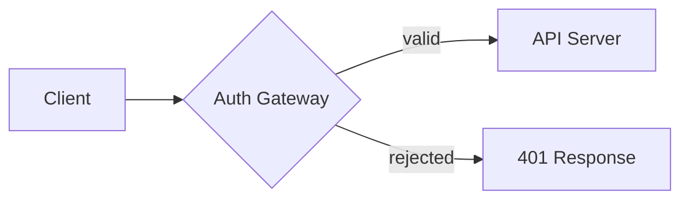

# forgr

> Convert Markdown to PDFs. One command, zero config.

<div align="center">


</div>

## Features

- **Five presets**: `terminal`, `minimal`, `technical`, `academic`, `newsletter`. Each preset is a standalone CSS theme.
- **Diagrams**: native [Mermaid](https://mermaid.js.org) rendering (flowchart, sequence, state, class) with per-preset color theming.
- **Images**: forgr inlines local images as base64 data URIs automatically. They resolve without a base URL.
- **Table of contents**: generated automatically for longer documents (>= 8000 words or 3+ pages), or forced on/off.
- **Cover page**: optional cover page with title, author, and date. Falls back to document metadata.
- **Footer**: choose between page numbers, page X of Y, or no footer.
- **Section numbering**: auto-number headings with CSS counters.
- **Doc-meta header**: show/hide a document-info header (dot, label, timestamp).
- **Interactive TUI**: `forgr-tui` provides a full terminal UI for preset picking, settings, and batch rendering. No CLI flags needed.
- **No install friction**: Chromium downloads on your first run, not during `npm install`.

---

## Install

```bash
npm install -g forgr
```

Chromium (~195MB) does not download during install. It downloads automatically on your first `forgr` run into `~/.forgr/browsers`. Subsequent runs skip this step.

---

## Quick start

```bash
# Output goes to the same directory as the input file
forgr report.md

# Custom output path
forgr report.md --output /path/to/output.pdf

# Choose a preset
forgr report.md --preset academic
```

## Presets

Pick a design with `--preset <name>`. Each preset is its own CSS theme. The five are visually distinct instead of being reskins of one template.

| Preset | Identity | Best for |
|---|---|---|
| `terminal` | All-mono headings, graphite/cold-teal palette, dark terminal-pane code blocks, `01 02 03` section counters | Infra reports, status dashboards, incident reviews |
| `minimal` | System sans, single gray, hairline rules, no accent | Clean, neutral documents |
| `technical` | Fully monospace, amber accent, full-grid tables, tinted code panels, `[NN]` bracket section markers | Runbooks, config specs, ops notes |
| `academic` | Book serif throughout, pine-green accent, arabic section numbers in the margin against a hairline vertical rule | Papers, theses, scholarly write-ups |
| `newsletter` | Warm off-white paper, serif headings, sans-serif body, terra-cotta coral accent, wide line length | Product changelogs, editorial round-ups, org announcements |

```bash
forgr document.md --preset technical
```

---

## Diagrams & images

Mermaid code blocks render to SVG inside the PDF. The diagram palette follows the active preset's accent color.

````bash
forgr document.md

# document.md

```mermaid
flowchart LR
  A[Client] --> B{Auth Gateway}
  B -->|valid| C[API Server]
  B -->|rejected| Z[401 Response]
```
````

forgr embeds local images as base64, so the PDF is self-contained:

```markdown

```

Remote URLs (`http://`, `https://`) and existing `data:` URIs pass through unchanged.

---

## Table of contents

forgr adds a table of contents automatically when a document is 8000 or more words, or 3 or more pages. Control it explicitly with `--toc` / `--no-toc`:

```bash
forgr long-report.md --toc
forgr short-note.md --no-toc
```

---

## CLI reference

| Flag | Description |
|---|---|
| `--output <path>` | Write the PDF to a specific path instead of next to the input file. |
| `--preset <name>` | Apply a preset: `terminal` (default), `minimal`, `technical`, `academic`, `newsletter`. |
| `--toc` / `--no-toc` | Force the table of contents on or off. Without either, forgr decides automatically. |
| `--doc-meta` / `--no-doc-meta` | Show or hide the doc-meta header. |
| `--date-format <iso\|locale>` | Date display format (`iso`: `2025-01-15`, `locale`: `Jan 15, 2025`). |
| `--date-locale <locale>` | Locale for date formatting (e.g. `en-US`, `es-ES`). |
| `--footer <page-numbers\|page-x-of-y\|none>` | Footer style. |
| `--cover` | Enable a cover page (falls back to document title/author/date). |
| `--cover-title <text>` | Cover page title (default: document title). |
| `--cover-author <text>` | Cover page author (default: document author). |
| `--cover-date <text>` | Cover page date (default: document date). |
| `--section-numbering` / `--no-section-numbering` | Enable or disable heading section numbering. |
| `--write` | Persist CLI flags into the file's front-matter for repeatable builds. |
| `convert <input>` | Convert a Markdown file to PDF (default command). |
| `doctor` | Diagnose installation and fix common issues. |
| `doctor --fix` | Auto-fix detected issues (re-download Chromium, remove malformed user presets). |
| `doctor --verbose` | Show full paths, file sizes, and timestamps. |
| `uninstall` | Remove the Chromium cache (~195MB) without removing the tool. |

### Front-matter

Control rendering from inside your Markdown file with YAML front-matter. CLI flags override front-matter, front-matter overrides defaults.

```yaml
---
title: My Document
author: Jane Doe
date: 2025-01-15
forgr:
  preset: academic
  toc: auto
  tocTitle: Contents
  cover: true
  coverTitle: "My Document"
  coverAuthor: "Jane Doe"
  coverDate: "2025-01-15"
  footer: page-numbers
  sectionNumbering: true
  docMeta: true
  dateFormat: iso
  dateLocale: en-US
  paperFormat: A4
  margins:
    top: 2cm
    bottom: 2cm
    left: 2cm
    right: 2cm
---
```

Shared keys (`title`, `author`, `date`, `preset`, `toc`) work at the top level or under `forgr:`. `preset` also accepts the legacy alias `layout`. Put all other forgr-only keys under `forgr:`.

Docs can also be written to with `--write`:

```bash
forgr report.md --preset academic --write
```

This saves `preset: academic` into the file's front-matter (omitting values that match defaults), so subsequent runs do not need the flag.

---

### Interactive preset picker

`forgr-tui` launches a full terminal UI that scans the current directory for
`.md` files and guides you through preset selection, rendering options, and
batch conversion.

```bash
forgr-tui                    # scan current directory for .md files
forgr-tui report.md          # process a specific file (skips file picker)
```

**Flow:**

1. **File picker**: if 2+ `.md` files found, select which to render (space to
   toggle, enter to confirm). If 0 files, exits with a message. If 1 file,
   auto-selects it. Pass a file argument to skip this step entirely.
2. **Preset picker**: choose from the five built-in presets (user presets
   shown for discovery. Rendering them lands in a later milestone).
3. **Settings screen**: configure table of contents (auto/on/off), doc-meta header, date
   format, footer style, cover page, and section numbering. Arrow keys to
   navigate, Enter to render.
4. **Batch render**: files render one at a time with per-file progress. A
   failure does not stop the batch.
5. **Result screen**: shows per-file success/failure, truncated to 6 visible files
   with `... N more`. Press `s` to save the current settings to all files'
   front-matter, `o` to open the folder, Enter to go back.

---

## Doctor

```bash
forgr doctor                 # check everything
forgr doctor --verbose       # full paths, file sizes
forgr doctor --fix           # auto-fix where possible
```

Checks Chromium, built-in presets, user presets, font files, the base template, and Node version. Reports a summary and exits with code 0 if all checks pass, 1 on failure.

`--fix` re-downloads Chromium if missing and removes malformed user preset files.

---

## Uninstall

Free up the Chromium cache (~195MB) without removing the tool:

```bash
forgr uninstall
```

The next `forgr` run will re-download Chromium automatically.

To remove forgr entirely:

```bash
npm uninstall -g forgr
```

---

## Requirements

- Node.js 18+

---

## Development

```bash
npm test                  # full suite (108 tests: unit, integration, comprehensive)
npm run test:unit         # unit tests only
npm run test:integration  # integration tests only
npm run test:mermaid      # mermaid-specific tests only
```

Integration tests accept a `FORGR_PRESET` environment variable (`terminal`, `minimal`, `technical`, `academic`, `newsletter`) to validate one preset at a time.

---

## License

MIT: see [LICENSE](LICENSE).
