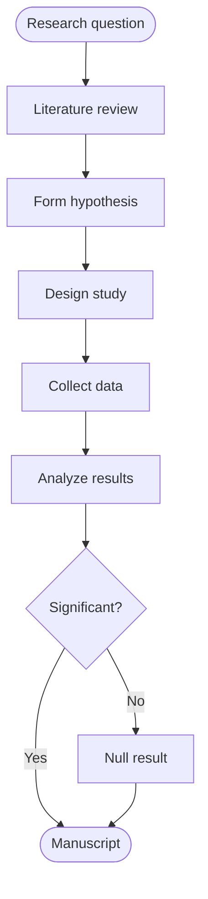
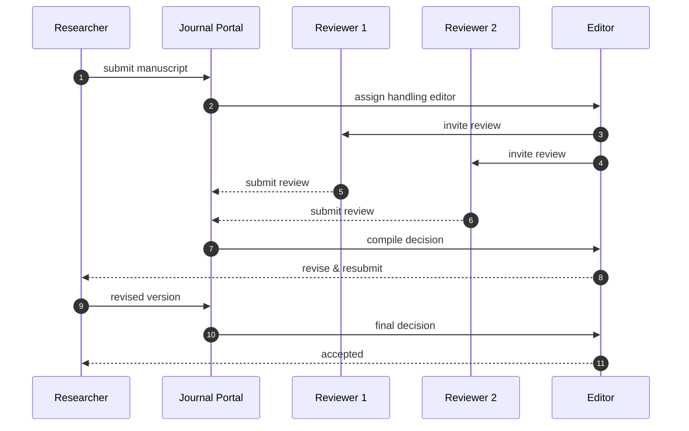
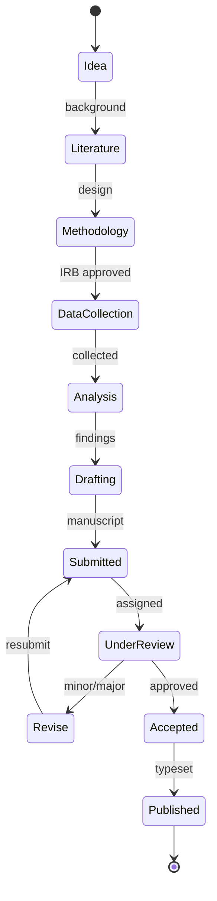
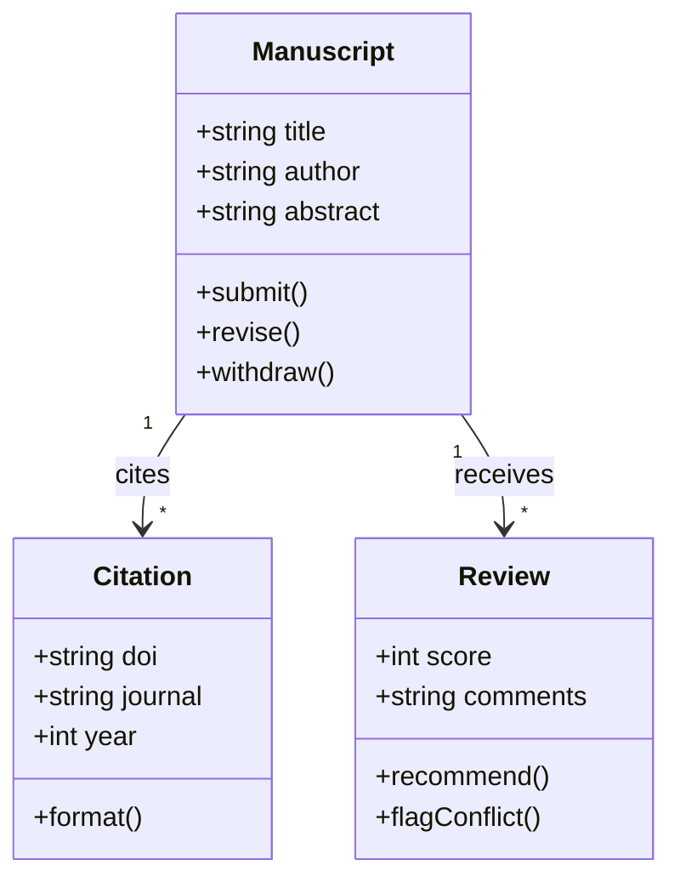
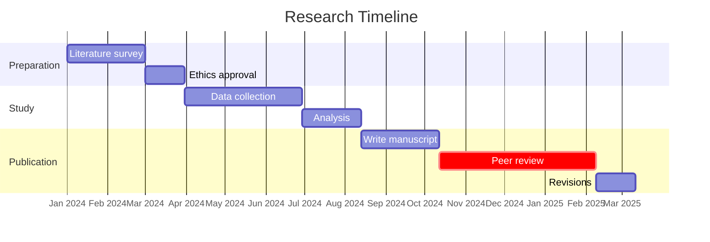
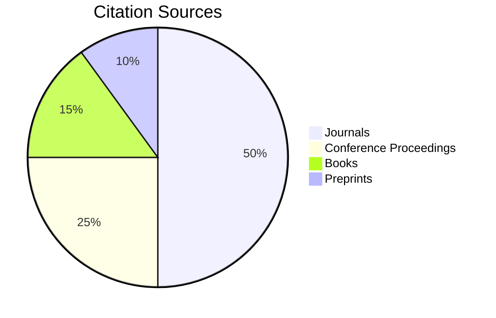
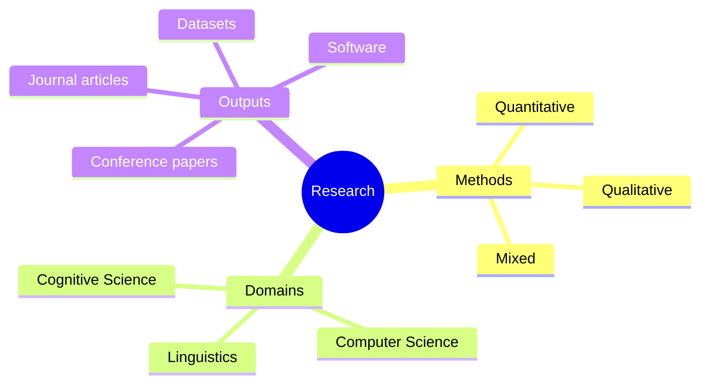
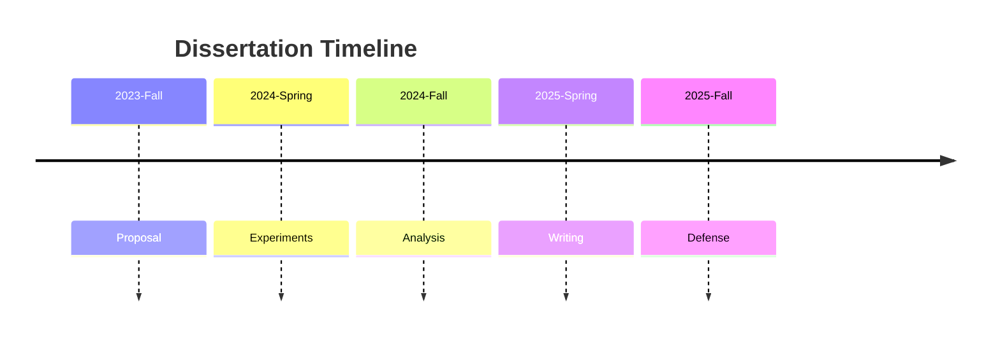
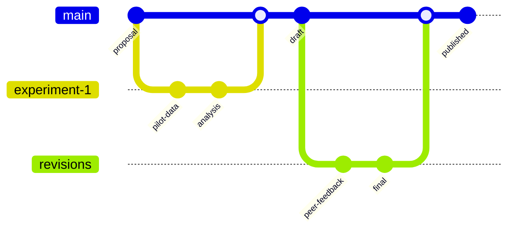

# Mermaid Diagrams — Academic

## Flowchart



## Sequence



## State



## Class



## Entity Relationship

```mermaid
erDiagram
  AUTHOR ||--o{ MANUSCRIPT : writes
  MANUSCRIPT ||--|| JOURNAL : submitted to
  MANUSCRIPT ||--o{ REVIEW : receives
  REVIEW ||--|| REVIEWER : written by
  MANUSCRIPT {
    int id PK
    string doi UK
    string title
    date submittedAt
    string status
  }
  REVIEW {
    int id PK
    int manuscriptId FK
    int reviewerId FK
    int score
    text comments
  }
```

## Gantt



## Pie



## Mindmap



## Timeline



## Git Graph


