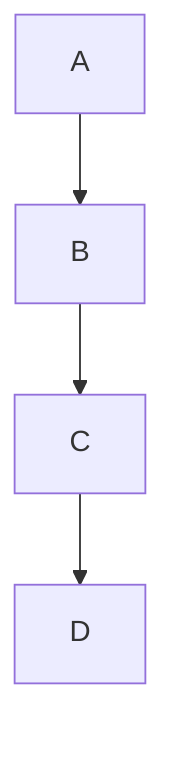
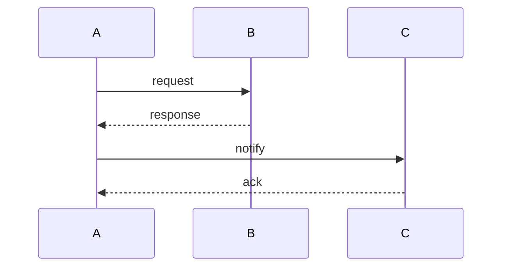
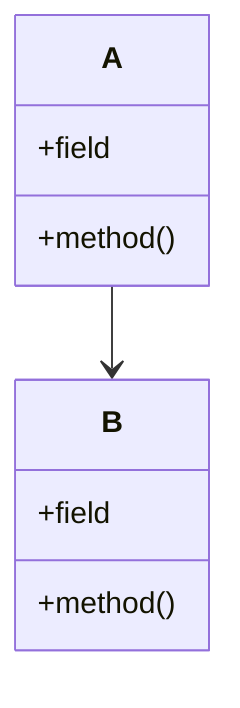
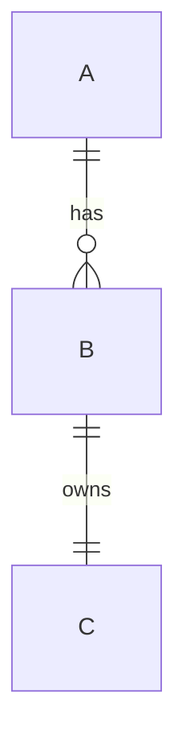
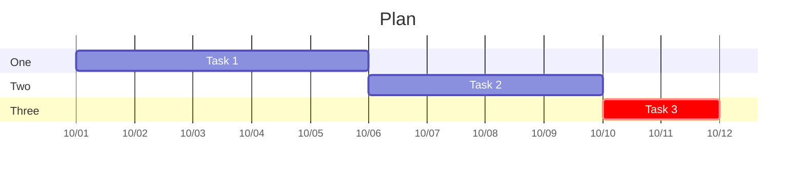
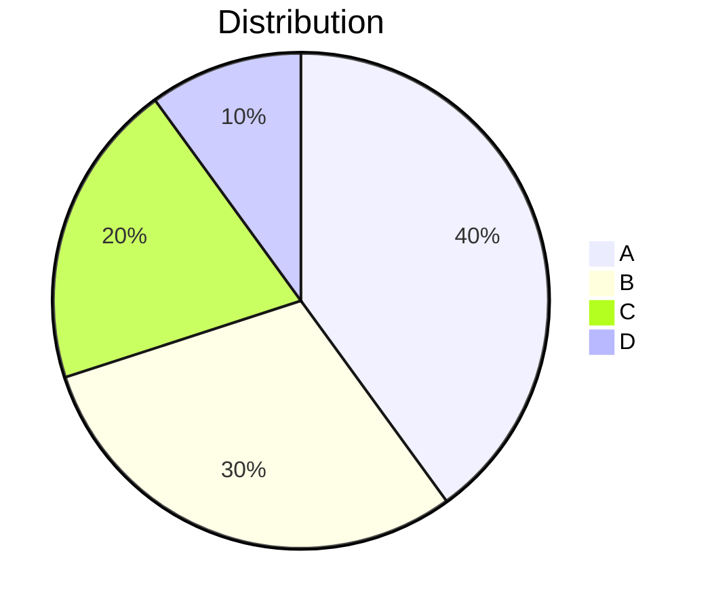
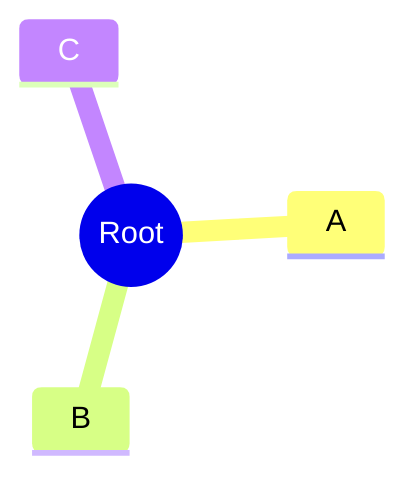
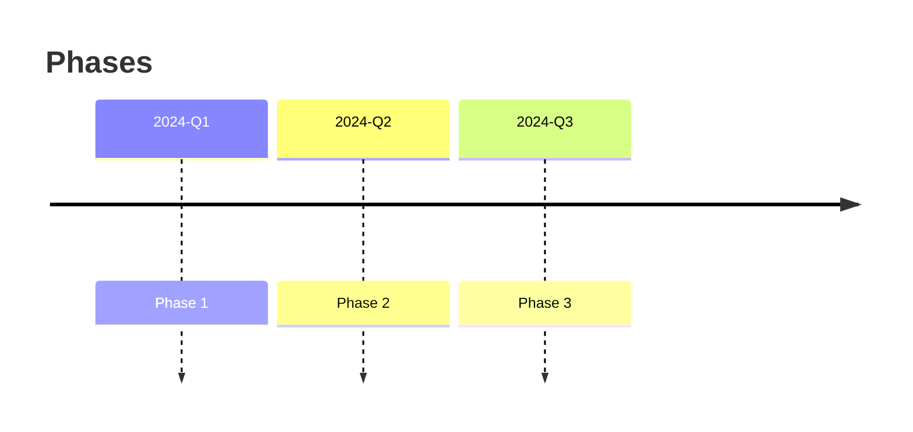
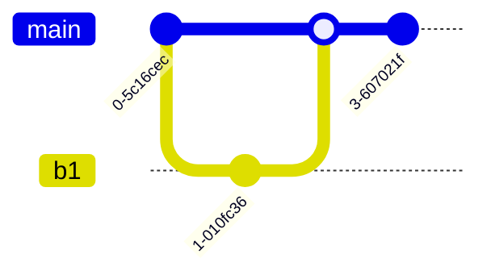

# Mermaid Diagrams — Minimal

## Flowchart

```mermaid
flowchart TD
  A --> B
  B --> C
  C --> D
```

## Sequence

```mermaid
sequenceDiagram
  A->>B: request
  B-->>A: response
  A->>C: notify
  C-->>A: ack
```

## State

```mermaid
stateDiagram-v2
  [*] --> A
  A --> B
  B --> C
  C --> [*]
```

## Class

```mermaid
classDiagram
  class A {
    +field
    +method()
  }
  class B {
    +field
    +method()
  }
  A --> B
```

## Entity Relationship

```mermaid
erDiagram
  A ||--o{ B : has
  B ||--|| C : owns
```

## Gantt

```mermaid
gantt
  title Plan
  dateFormat YYYY-MM-DD
  axisFormat %m/%d
  section One
    Task 1 :t1, 2024-10-01, 5d
  section Two
    Task 2 :t2, after t1, 4d
  section Three
    Task 3 :crit, t3, after t2, 2d
```

## Pie

```mermaid
pie title Distribution
  "A" : 40
  "B" : 30
  "C" : 20
  "D" : 10
```

## Mindmap

```mermaid
mindmap
  root((Root))
    A
    B
    C
```

## Timeline

```mermaid
timeline
  title Phases
  2024-Q1 : Phase 1
  2024-Q2 : Phase 2
  2024-Q3 : Phase 3
```

## Git Graph

```mermaid
gitGraph
  commit
  branch b1
  checkout b1
  commit
  checkout main
  merge b1
  commit
```
