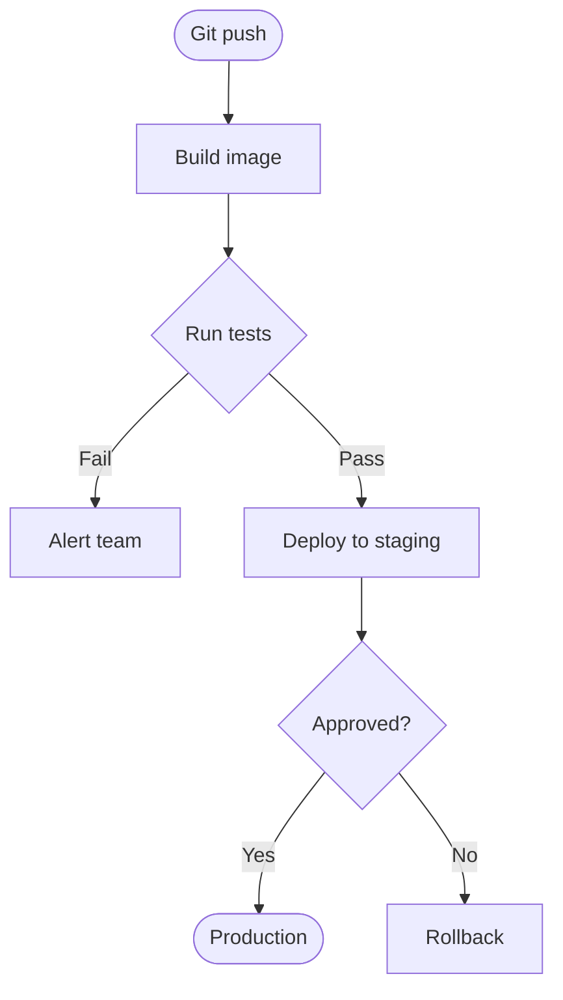
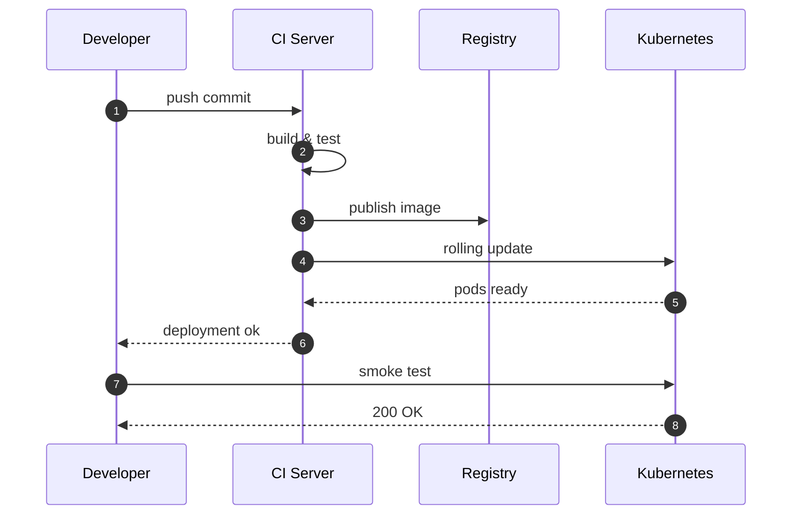
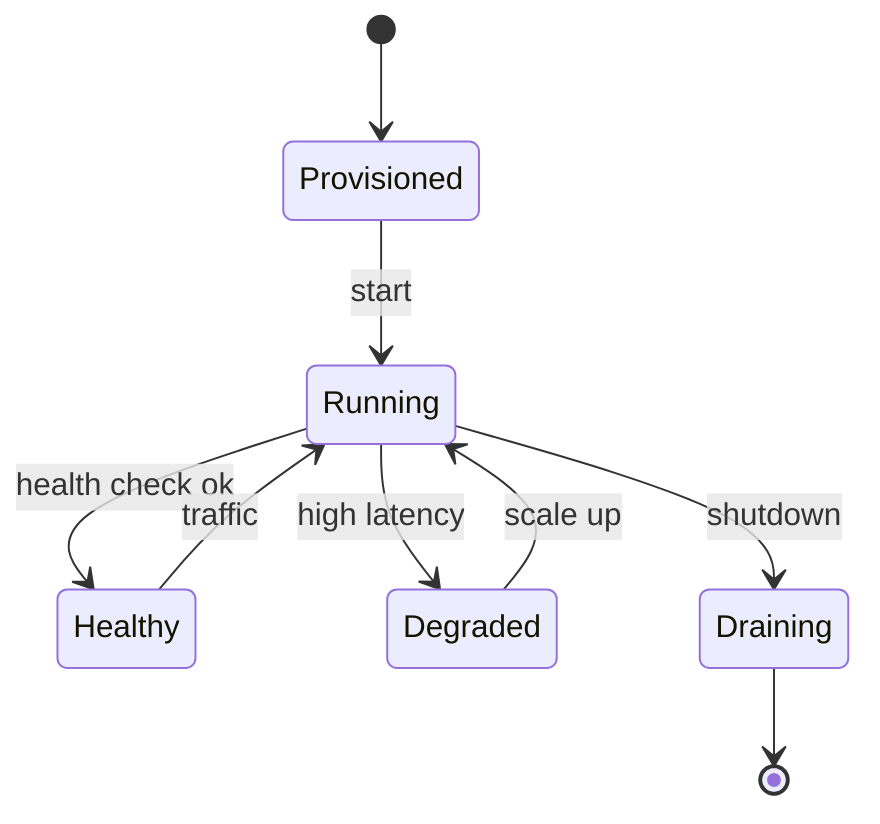
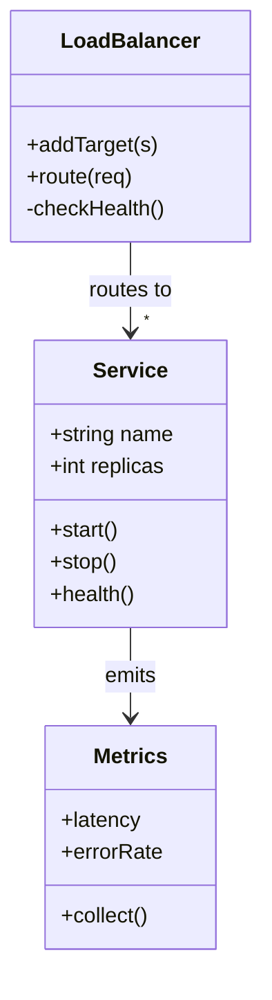
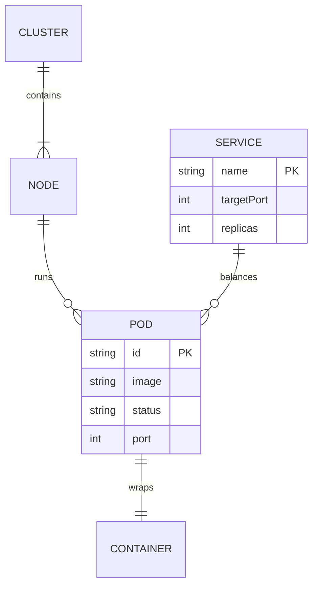
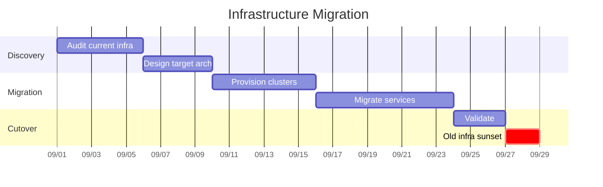
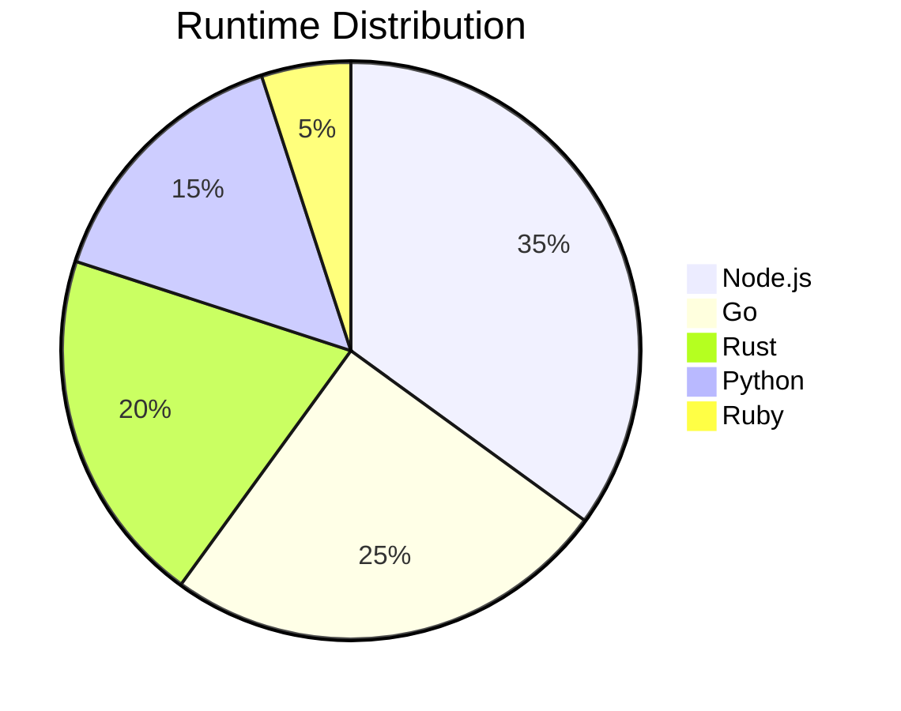
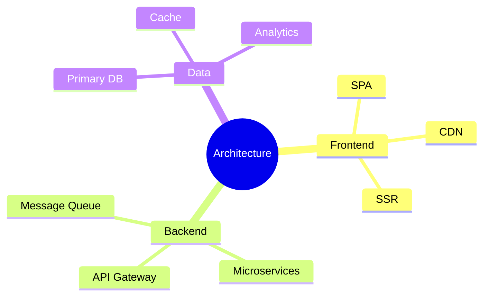
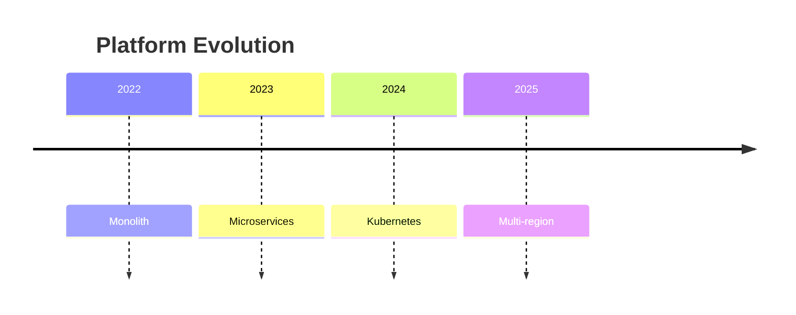
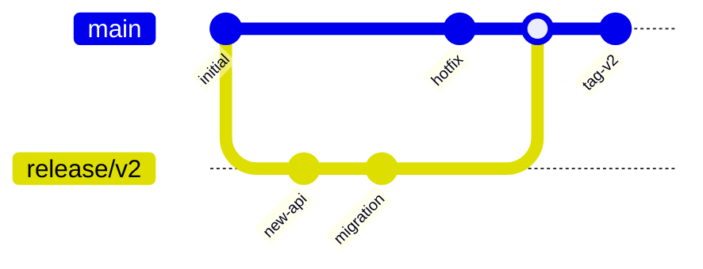

# Mermaid Diagrams — Technical

## Flowchart

```mermaid
flowchart TD
  Commit([Git push]) --> Build[Build image]
  Build --> Test{Run tests}
  Test -->|Fail| Notify[Alert team]
  Test -->|Pass| Deploy[Deploy to staging]
  Deploy --> Approve{Approved?}
  Approve -->|Yes| Prod([Production])
  Approve -->|No| Rollback[Rollback]
```

## Sequence

```mermaid
sequenceDiagram
  autonumber
  participant D as Developer
  participant C as CI Server
  participant R as Registry
  participant K as Kubernetes
  D->>C: push commit
  C->>C: build & test
  C->>R: publish image
  C->>K: rolling update
  K-->>C: pods ready
  C-->>D: deployment ok
  D->>K: smoke test
  K-->>D: 200 OK
```

## State

```mermaid
stateDiagram-v2
  [*] --> Provisioned
  Provisioned --> Running: start
  Running --> Healthy: health check ok
  Running --> Degraded: high latency
  Degraded --> Running: scale up
  Healthy --> Running: traffic
  Running --> Draining: shutdown
  Draining --> [*]
```

## Class

```mermaid
classDiagram
  class Service {
    +string name
    +int replicas
    +start()
    +stop()
    +health()
  }
  class LoadBalancer {
    +addTarget(s)
    +route(req)
    -checkHealth()
  }
  class Metrics {
    +latency
    +errorRate
    +collect()
  }
  LoadBalancer --> "*" Service : routes to
  Service --> Metrics : emits
```

## Entity Relationship

```mermaid
erDiagram
  CLUSTER ||--|{ NODE : contains
  NODE ||--o{ POD : runs
  POD ||--|| CONTAINER : wraps
  SERVICE ||--o{ POD : balances
  POD {
    string id PK
    string image
    string status
    int port
  }
  SERVICE {
    string name PK
    int targetPort
    int replicas
  }
```

## Gantt

```mermaid
gantt
  title Infrastructure Migration
  dateFormat YYYY-MM-DD
  axisFormat %m/%d
  section Discovery
    Audit current infra  :d1, 2024-09-01, 5d
    Design target arch   :d2, after d1, 4d
  section Migration
    Provision clusters   :m1, after d2, 6d
    Migrate services     :m2, after m1, 8d
  section Cutover
    Validate             :v1, after m2, 3d
    Old infra sunset     :crit, s1, after v1, 2d
```

## Pie

```mermaid
pie title Runtime Distribution
  "Node.js" : 35
  "Go" : 25
  "Rust" : 20
  "Python" : 15
  "Ruby" : 5
```

## Mindmap

```mermaid
mindmap
  root((Architecture))
    Frontend
      SPA
      CDN
      SSR
    Backend
      API Gateway
      Microservices
      Message Queue
    Data
      Primary DB
      Cache
      Analytics
```

## Timeline

```mermaid
timeline
  title Platform Evolution
  2022 : Monolith
  2023 : Microservices
  2024 : Kubernetes
  2025 : Multi-region
```

## Git Graph

```mermaid
gitGraph
  commit id: "initial"
  branch release/v2
  checkout release/v2
  commit id: "new-api"
  commit id: "migration"
  checkout main
  commit id: "hotfix"
  merge release/v2
  commit id: "tag-v2"
```
