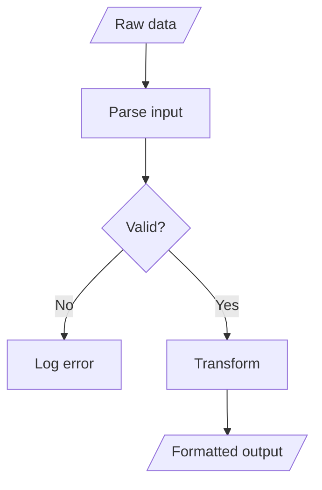
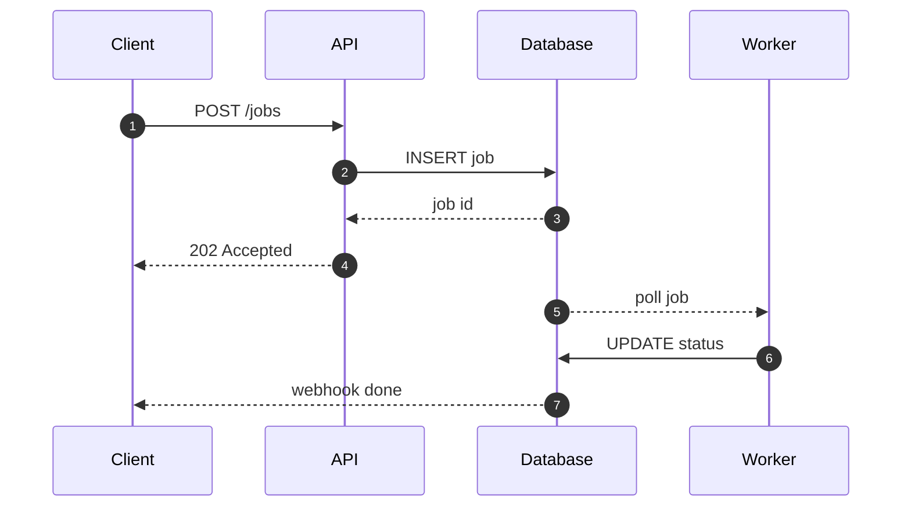
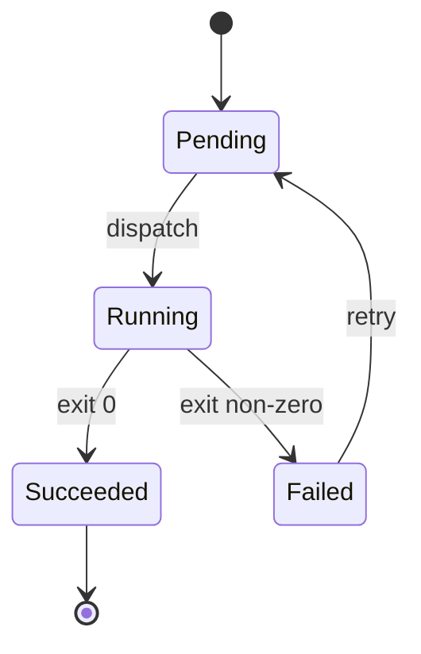
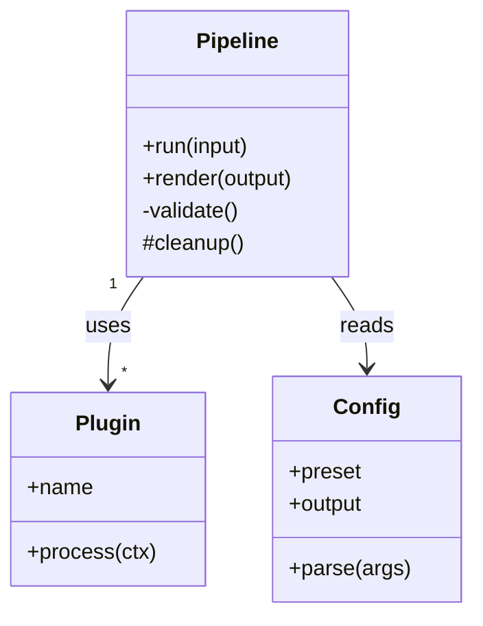
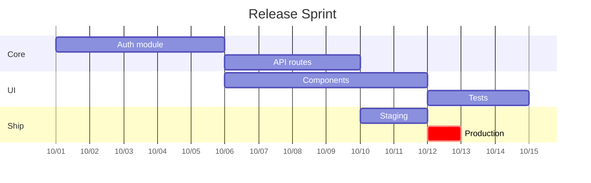
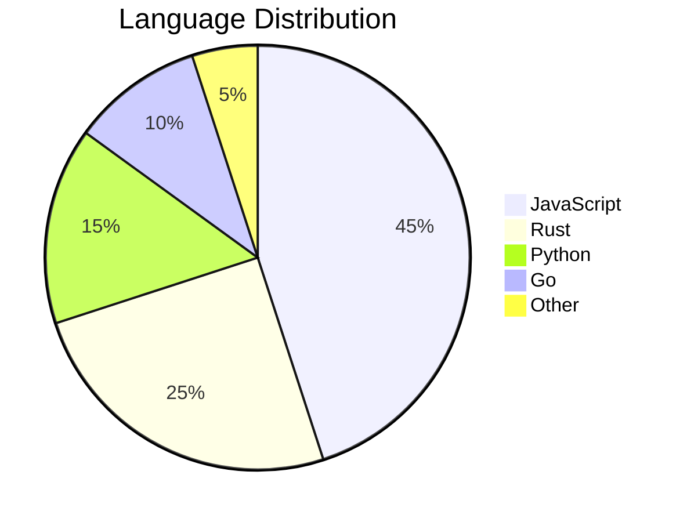
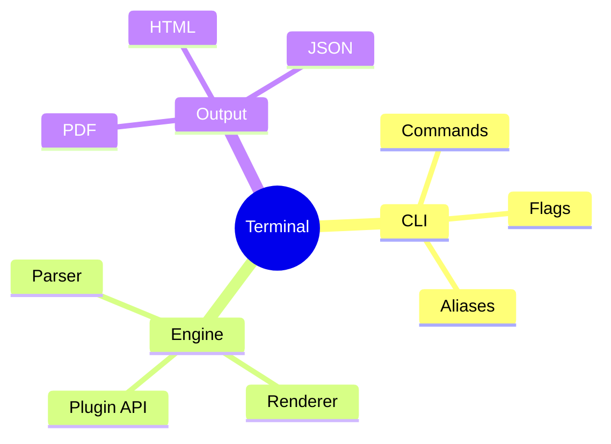
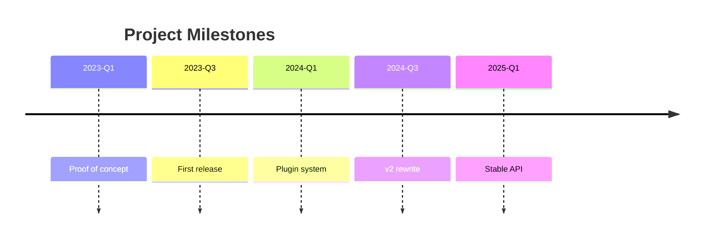
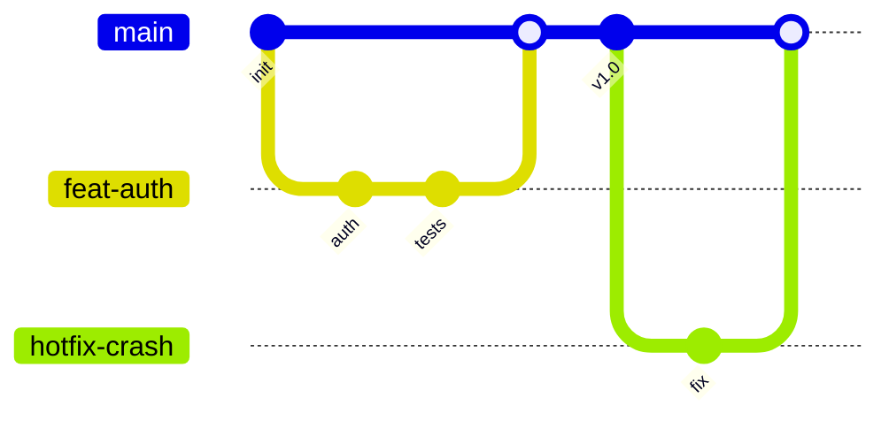

# Mermaid Diagrams — Terminal

## Flowchart



## Sequence



## State



## Class



## Entity Relationship

```mermaid
erDiagram
  PROJECT ||--|{ JOB : contains
  JOB ||--|| WORKER : assigned to
  JOB ||--o{ LOG : produces
  JOB {
    int id PK
    string status
    date startedAt
  }
  WORKER {
    int id PK
    string name
    string version
  }
```

## Gantt



## Pie



## Mindmap



## Timeline



## Git Graph


