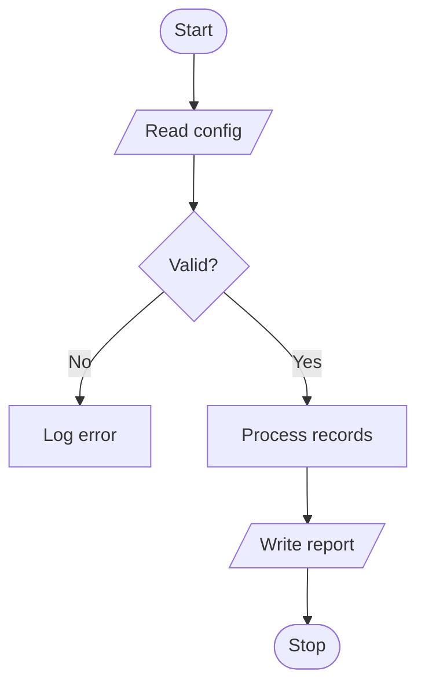
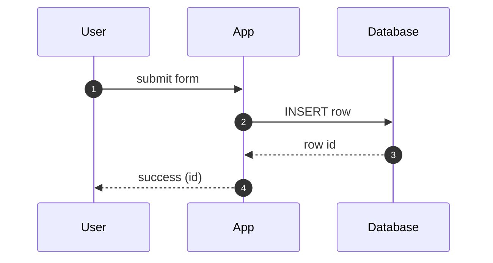
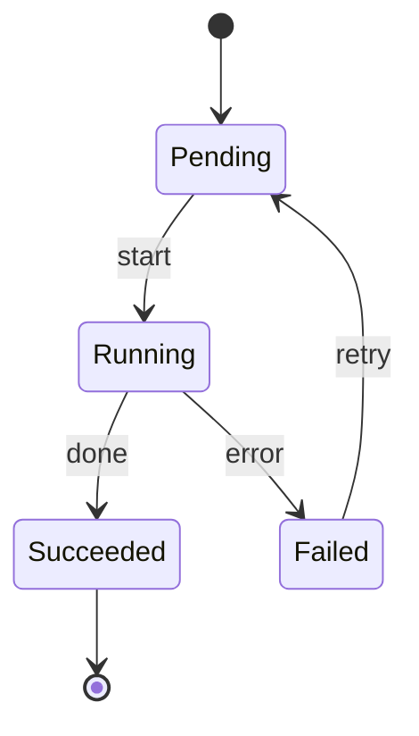
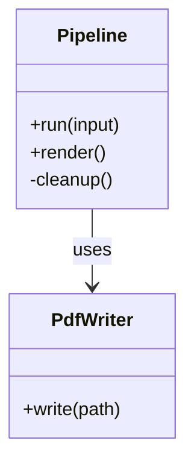
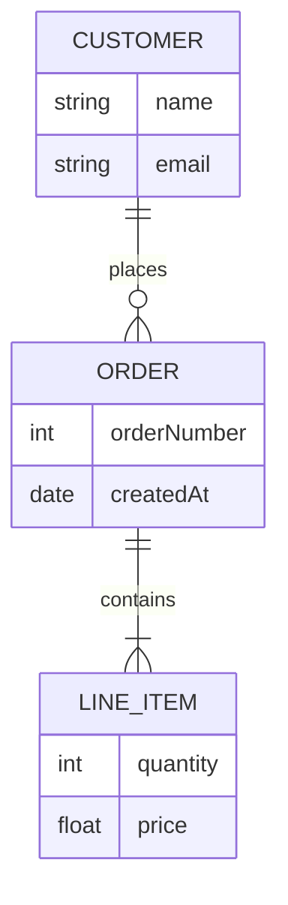
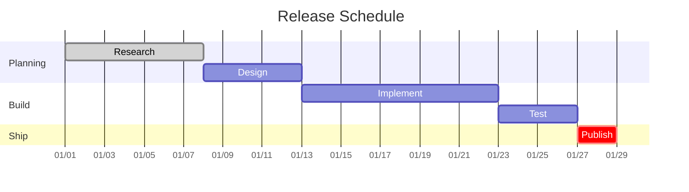
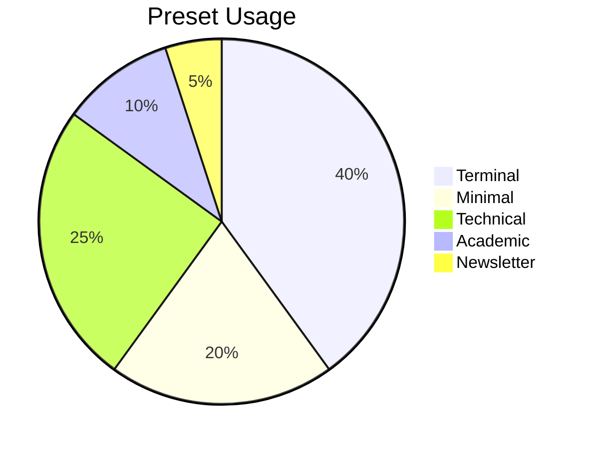
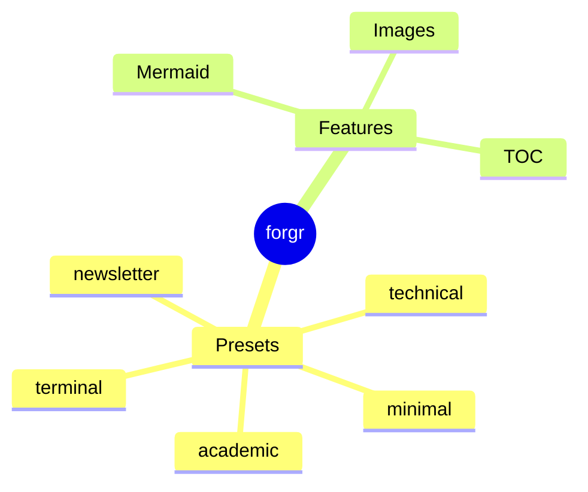
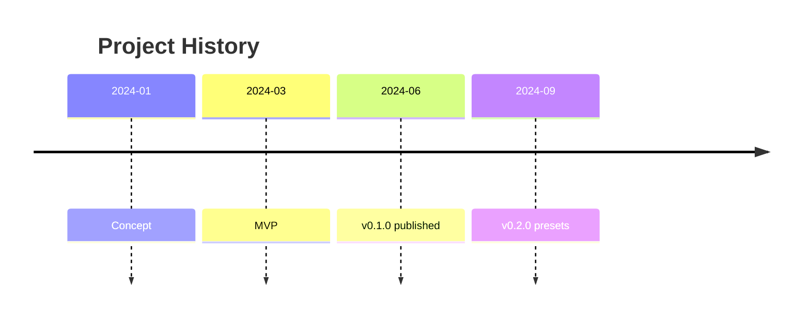
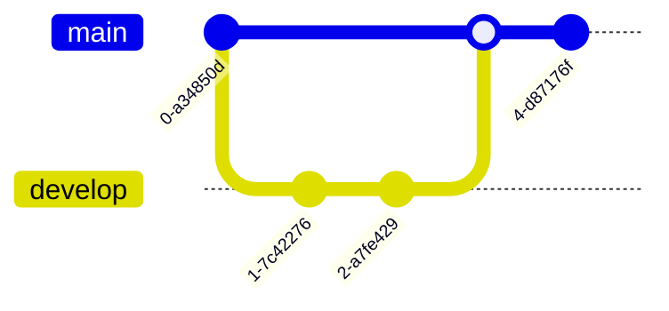

# Mermaid Diagrams

This fixture exercises the mermaid fence renderer. Each block is emitted as a
`
` so the pipeline can hand it to an in-browser mermaid
runtime. It covers the most widely used diagram types so every preset's
mermaid palette is exercised end to end.

## Flowchart

## Sequence

## State

## Class

## Entity Relationship

## Gantt

## Pie

## Mindmap

## Timeline

## Git Graph

