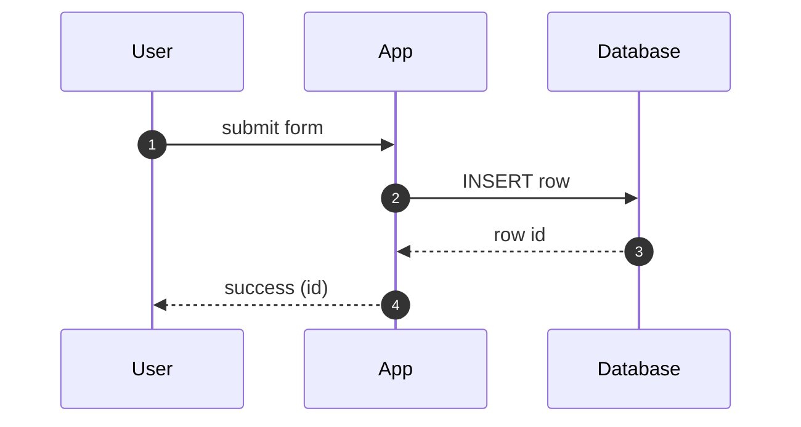
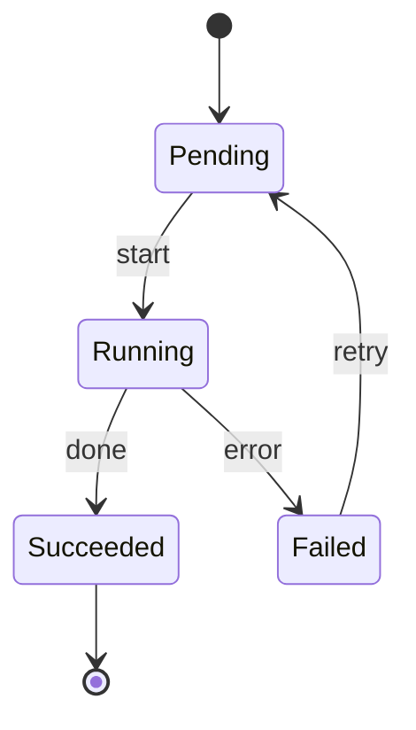
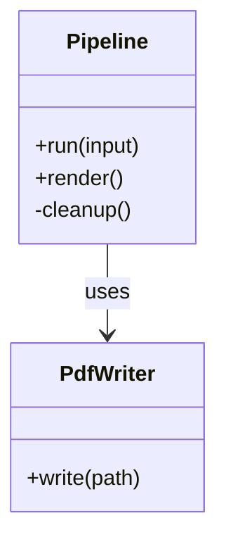

# Mermaid Diagrams

This fixture exercises the mermaid fence renderer. Each block is emitted as a
`
` so the pipeline can hand it to an in-browser mermaid
runtime (Milestone 4 wiring) when one is present.

## Flowchart

## Sequence

## State

## Class

