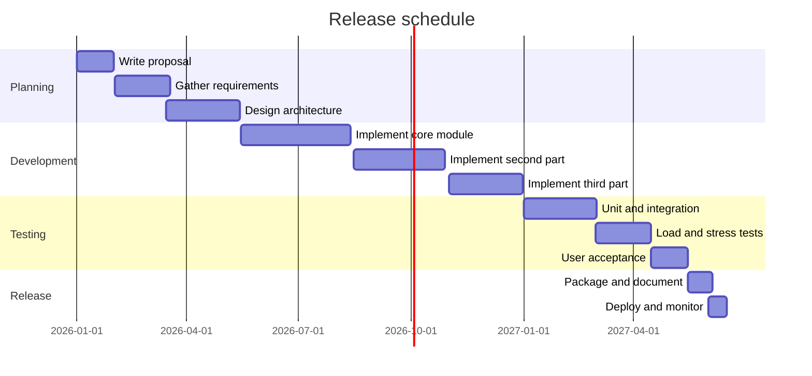
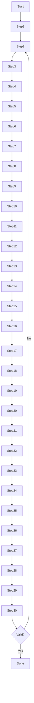
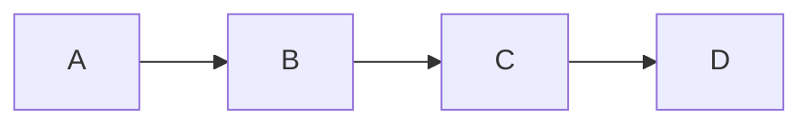

# Mermaid sizing fixture

This document exercises the mermaid sizing and placement logic: a wide gantt, a tall vertical flowchart, and several sections that push diagrams across page boundaries. All content is synthetic.

## 1. Wide Diagram

Wide diagrams such as gantt charts are capped at the content width so they never overflow the page.

## 2. Tall Diagram

A vertical flowchart taller than a page is scaled down so the whole diagram fits on one page instead of splitting mid-diagram.

## 3. Page-Boundary Sections

Each section below pairs a heading with a small diagram. The paragraph length is tuned so diagrams land near page boundaries and the placement pass keeps them with their headings.

### 3.1 First Flow

A short paragraph that carries the previous content across the page boundary. Lorem ipsum dolor sit amet, consectetur adipiscing elit. Sed do eiusmod tempor incididunt ut labore et dolore magna aliqua. Ut enim ad minim veniam, quis nostrud exercitation ullamco laboris.

### 3.2 Second Flow

Another paragraph of comparable length so the next diagram sits close to the bottom of the page. Duis aute irure dolor in reprehenderit in voluptate velit esse cillum dolore eu fugiat nulla pariatur. Excepteur sint occaecat cupidatat non proident.

### 3.3 Third Flow

Yet more text to nudge the following diagram across the next page boundary. At vero eos et accusamus et iusto odio dignissimos ducimus qui blanditiis praesentium voluptatum deleniti atque corrupti quos dolores.

### 3.4 Fourth Flow

Temporibus autem quibusdam et aut officiis debitis aut rerum necessitatibus saepe eveniet ut et voluptates repudiandae sint et molestiae non recusandae. Itaque earum rerum hic tenetur a sapiente delectus.

### 3.5 Fifth Flow

Ut aut reiciendis voluptatibus maiores alias consequatur aut perferendis doloribus asperiores repellat. Sed ut perspiciatis unde omnis iste natus error sit voluptatem accusantium doloremque laudantium.

### 3.6 Sixth Flow

Totam rem aperiam, eaque ipsa quae ab illo inventore veritatis et quasi architecto beatae vitae dicta sunt explicabo. Nemo enim ipsam voluptatem quia voluptas sit aspernatur aut odit aut fugit.

### 3.7 Seventh Flow

Sed quia consequuntur magni dolores eos qui ratione voluptatem sequi nesciunt. Neque porro quisquam est, qui dolorem ipsum quia dolor sit amet, consectetur, adipisci velit.

### 3.8 Eighth Flow

Quis autem vel eum iure reprehenderit qui in ea voluptate velit esse quam nihil molestiae consequatur. Vel illum qui dolorem eum fugiat quo voluptas nulla pariatur.

